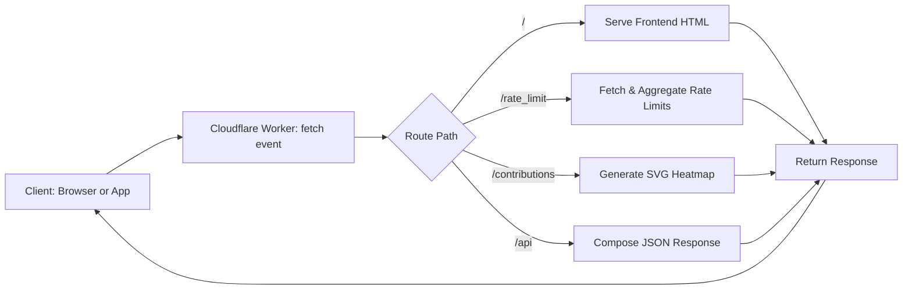

# GitHub Profile Analyzer

A serverless webb app built with Cloudflare Workers to fetch and visualize GitHub user data. This tool helps developers understand their GitHub presence through visualizations, badge tracking, and AI-powered analysis.

## Features
- Aggregate GitHub API rate-limit status across multiple tokens
- Generate a contribution calendar as an SVG heatmap
- Expose achievement badges as JSON
- CORS-protected endpoints with configurable origin
- Built-in caching for performance
- Integrated Cerebras AI LLM (Llama 4) with a complete UI
- Token rotation for higher API request limits
- Responsive SVG rendering for contributions

## Setup
1. Clone this repository:
   ```powershell
   git clone https://github.com/0xarchit/github-profile-analyzer.git
   cd "github-profile-analyser"
   ```
2. Install Wrangler CLI:
   ```powershell
   npm install -g @cloudflare/wrangler
   ```
3. Create or update `wrangler.toml` with your variables:
   ```toml
   name = "github-profile-analyzer"
   type = "javascript"

   [vars]
   GITHUB_TOKENS = "token1,token2"
   CEREBRAS_KEYS  = "key1,key2"
   FRONTEND_ORIGIN = "https://your-frontend.example.com"
   ```
4. Publish to Cloudflare:
   ```powershell
   wrangler publish
   ```

## Workflow
Below is a simplified flowchart of how the main `worker.js` handles incoming requests:



## API Endpoints

| Endpoint | Description |
|----------|-------------|
| `/` | Serves the frontend HTML interface |
| `/rate_limit` | Returns GitHub API rate-limit status across all tokens |
| `/contributions` | Generates SVG heatmap of user contributions |
| `/api` | Complete JSON response including badges, contributions, and profile data |

## How It Works

The worker uses a combination of GitHub REST API calls and specialized techniques:

1. **Badge Detection**: Uses HEAD requests to GitHub achievement URLs to determine which badges a user has unlocked
2. **Rate Limit Management**: Distributes requests across multiple GitHub tokens to maximize available API calls
3. **Contribution Visualization**: Converts GitHub contribution data into an interactive SVG heatmap
4. **AI Analysis**: Leverages Cerebras Llama 4 LLM to analyze contribution patterns and provide insights

## Architecture

The project is organized with separate modules for better code organization:

### worker.js (Main Service)
This is the standalone Cloudflare Worker that combines all capabilities into a single deployable service. It handles all API routes, authentication, caching, and CORS policies. The worker.js file is what you deploy to Cloudflare.

### badge.js (Badge Detection Logic)
A reference implementation showing how GitHub achievement badges are detected:
- Contains the complete list of achievement badge assets and their URLs
- Implements the `checkAchievementStatus()` function that makes HEAD requests to GitHub
- Can be tested independently for badge detection functionality

### contri-graph.js (Contribution Graph Generator)
A reference implementation showing how the contribution SVG is generated:
- Uses GitHub GraphQL API to fetch a user's contribution calendar
- Implements SVG generation with responsive sizing
- Creates a heatmap visualization with intensity-based coloring
- Can be run independently to test SVG generation

## License

see [LICENSE](LICENSE) file.